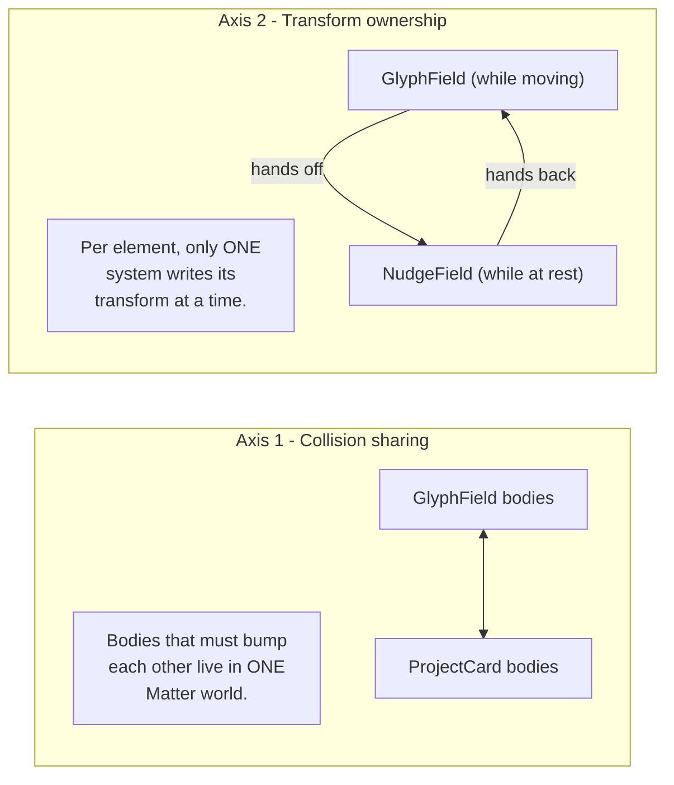
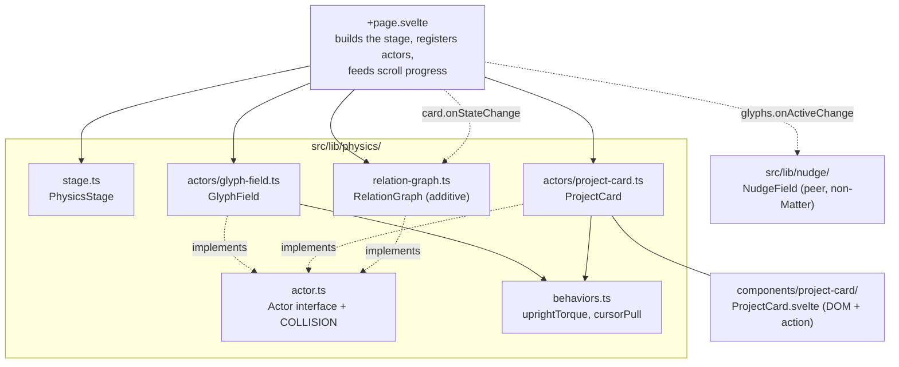
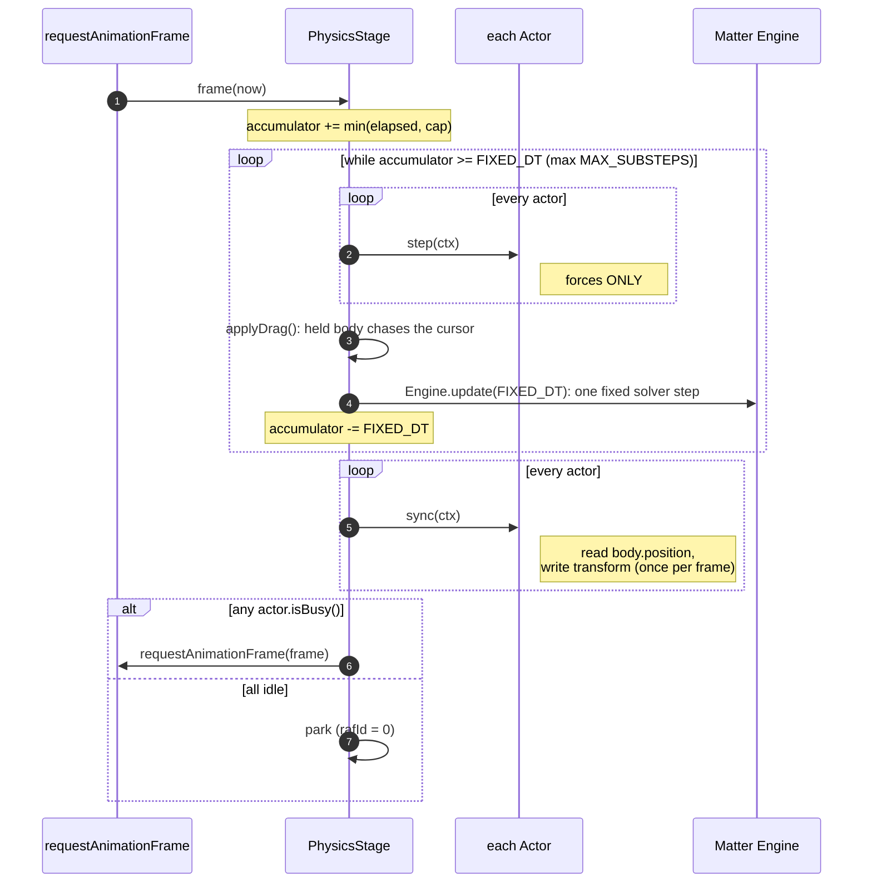
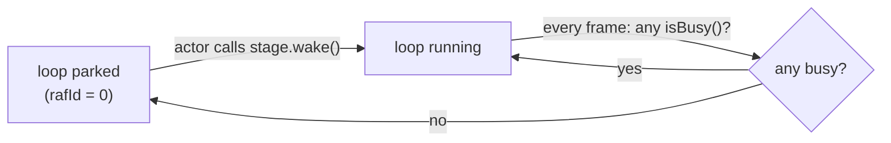
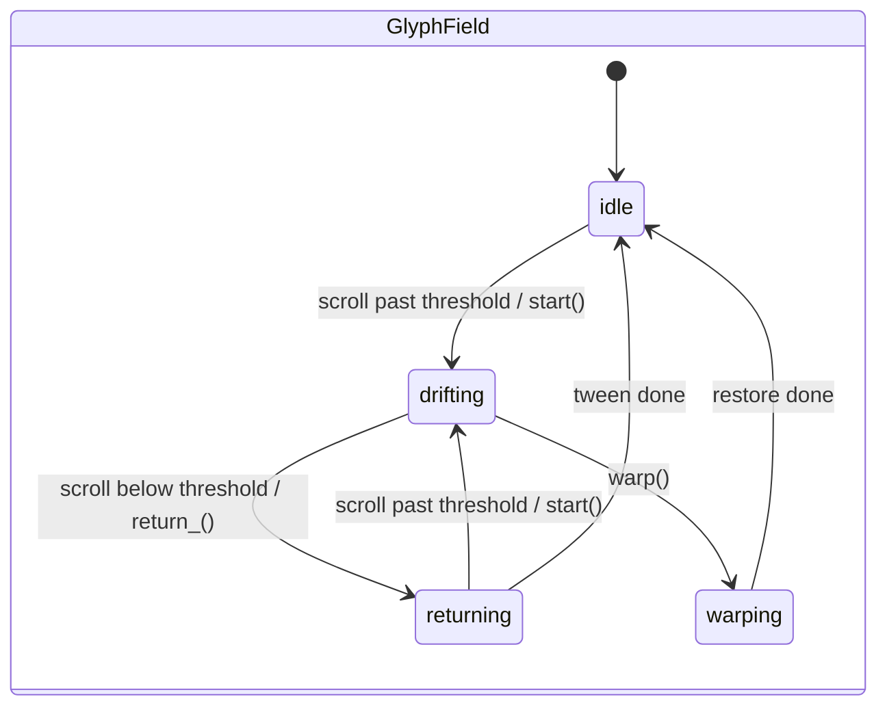
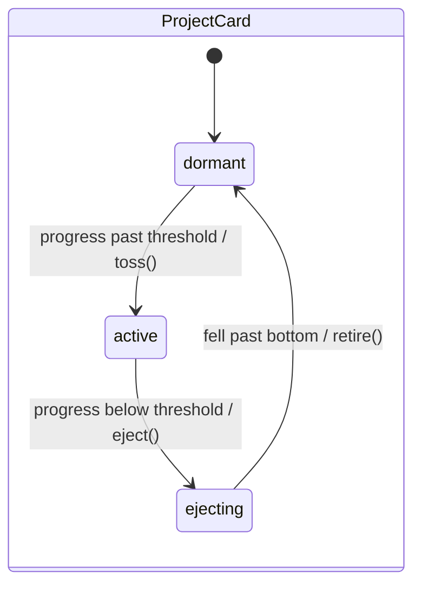
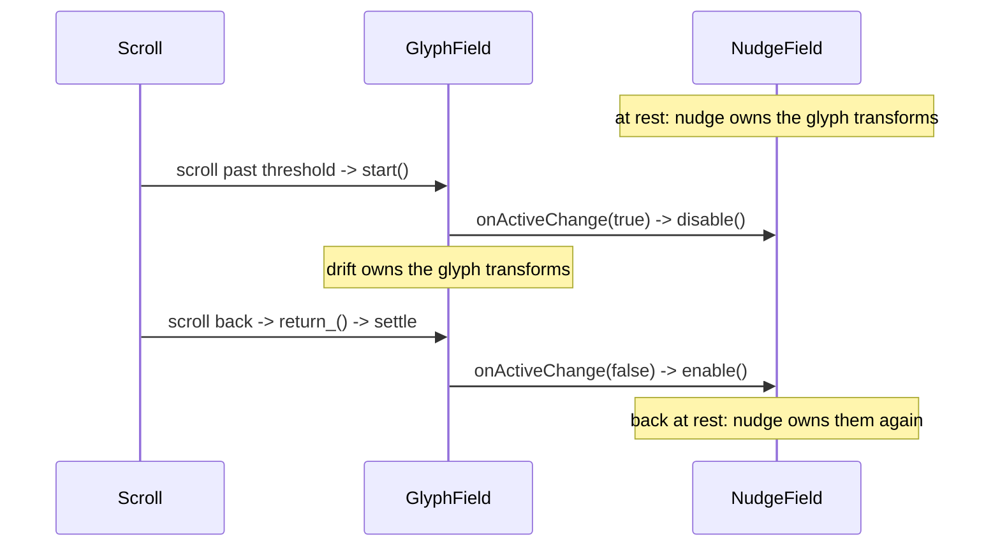
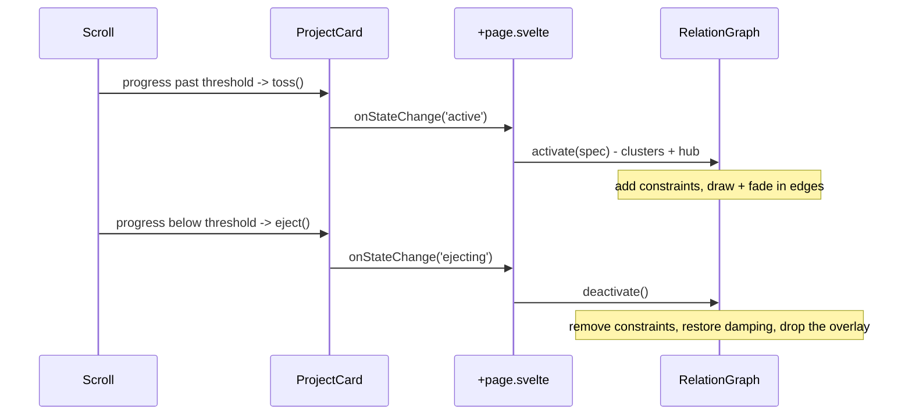

# Understanding the physics system

How the homepage drives DOM elements as physical bodies, and why it is built the way it is.
This page is for understanding; it is meant to be read away from the code. To actually change
something, see the [how-to guides](../how-to/add-an-actor.md); for exact signatures and
tunables, read the source in `src/lib/physics/`.

The code lives in `src/lib/physics/` (the shared world and its actors) and `src/lib/nudge/`
(a separate, cooperating effect). The homepage wires it together in `src/routes/+page.svelte`.

## The core idea: two axes

The hard part of this kind of animation is not the physics, it is the coordination. There are
two distinct problems, and they are solved by two different mechanisms. Keeping them separate
is what keeps the system extensible.



- **Axis 1 (collision sharing).** If two things have to physically collide, they must share one
  Matter engine. That shared world is the `PhysicsStage`. Glyphs and cards are actors on it, so
  the free-floating title glyphs actually bump the heavy cards.
- **Axis 2 (transform ownership).** A single DOM element can only have one `transform` at a
  time. The drift (active while moving) and the cursor nudge (active at rest) take turns on the
  same glyph elements. They never run at once; they hand off via a callback.

The mistake to avoid is collapsing these into one thing. The nudge is **not** an actor and does
**not** belong in the Matter world. It runs in the opposite phase (at rest) and is a
deliberately cheap hand-rolled spring. Forcing it into the stage would fight its design. The
reasoning is spelled out in [why the nudge is a peer](#why-the-nudge-is-a-peer-not-an-actor)
below.

## How the pieces fit together



The `PhysicsStage` owns everything that must be singular because the world is shared: the one
Matter engine, the four viewport walls, the one animation-frame loop, the fixed-timestep solver
step, pointer grab-and-throw, and the debug overlay. It knows nothing about glyphs or cards.
Those are actors: self-contained behaviors that own their own bodies and DOM elements while the
stage owns the engine and the loop. Each file under `src/lib/physics/` owns one of these
responsibilities; read the source for the exact API.

## The frame loop, and why only the stage steps the engine

This is the single most important thing to understand. The world is shared, so **only the stage
steps the engine**, and it does so on a **fixed timestep**. Each rendered frame, the stage adds
the real elapsed time to an accumulator and runs as many fixed solver steps (`FIXED_DT`, 1000/60
ms each) as that time has bought, up to a cap. A force-applying `step` runs once per solver
substep; the position-reading `sync` runs once per rendered frame.

Why fixed steps instead of one step per frame: `requestAnimationFrame` fires more often on a
144Hz display and less often when a tab is throttled to 30Hz, so stepping once per frame with a
fixed delta would run the simulation too fast or too slow. Advancing by real elapsed time keeps
it at the same wall-clock rate everywhere. The cap (`MAX_SUBSTEPS`) bounds catch-up after a
stall so a long frame cannot queue an ever-growing backlog of steps, the "spiral of death".



Several consequences follow, and they are the rules an actor must respect:

- **Never call `Engine.update` from an actor.** The stage owns the solver; an extra call would
  corrupt the shared world.
- **`step` runs per solver substep (0 to `MAX_SUBSTEPS` times a frame); `sync` runs once a
  frame.** Put per-physics-step forces in `step`, and put once-per-frame work (reading the
  solved position, writing the transform, advancing a wall-clock-timed tween) in `sync`. A
  frame can run zero solver steps yet still `sync`, which is what keeps transforms smooth at the
  display's full refresh rate.
- **`ctx.dtMs` is always `FIXED_DT`, never a variable frame delta.** Forces are tuned against
  that constant step.
- **World membership goes through the stage.** Adding and removing bodies via the stage (rather
  than the engine directly) keeps the grab set and the world in sync. Constraints (springs) are
  the other kind of membership and go through `stage.addConstraint` / `removeConstraint` the same
  way; the solver resolves them in the same step.

The how-to guides restate these as a checklist at the point of action.

## The coordinate model

Every actor maps a body's world position to a CSS transform the same way. It measures the
element's **home** (its laid-out center, captured with no active transform) once, then each
frame sets the transform from the body's offset from home:

```
dx = body.position.x - home.x
dy = body.position.y - home.y
el.style.transform = translate3d(dx, dy, 0) rotate(deg)
```

The home is just the transform origin. A card never rests at its home; it flies in from below
and settles wherever physics leaves it, but the home is still the reference the transform is
measured from. Measure the home while the element has no inline transform, or the offset gets
baked in twice.

The hero is `sticky top-16`, pinned at viewport y=64 regardless of scroll. That is why glyph
homes are scroll-independent, and why the warp can `scrollTo(0, 0)` without shifting anything.

## Why cards pass through the floor

All four walls keep the lightweight glyphs on screen. But cards have to spawn below the
viewport and eject out the bottom, so they must pass through the floor while still bumping
everything else. Matter collision filters make this possible: two bodies collide only if each
one's mask includes the other's category. Cards carry a mask that excludes the floor wall;
glyphs use the default mask and stay penned in. The exact category values live in `COLLISION`
in `src/lib/physics/actor.ts`.

## The demand-driven loop and actor lifecycles

The loop is demand-driven. It runs while at least one actor reports that it is busy, and parks
itself otherwise. An actor that wants frames again wakes the stage.



So a well-behaved actor wakes the stage when it starts needing frames (a spawn, a state change,
a pointer event it cares about), reports busy while it has live bodies or a running animation,
and reports idle once it is back to rest so the loop can park.

The two actors today are small state machines:





A glyph field is busy while it is not idle; a card is busy while it is not dormant.

## Why the nudge is a peer, not an actor

The nudge is the other half of axis 2. It is a separate, non-Matter spring in `src/lib/nudge/`:
as the cursor passes near a glyph at rest it shoves it a little, then a spring eases it home. It
owns the glyph transforms **at rest**; the drift owns them while moving. They are mutually
exclusive because both write the same elements' `transform`.

The handoff is a single callback. The glyph field announces when it takes the glyphs and when
it hands them back:



It is not an actor because it runs in the opposite phase (at rest, when the Matter bodies do not
even exist), it acts on a different lifecycle, and it is intentionally a cheap clamped spring.
Modelling it as a stage actor would be a worse fit, not a cleaner one. This is the template for
any future at-rest effect; see [how to add a peer effect](../how-to/add-a-peer-effect.md).

## Relationship graphs: additive effects over shared bodies

The drift and the nudge are the two original axes. The relationship graph (`RelationGraph` in
`relation-graph.ts`) is a third kind of thing, and it is worth understanding why it is neither an
actor that owns bodies nor a peer that runs off to the side. It is an **additive** effect: it
borrows bodies that already exist on the stage, hangs springs between them, and draws connective
lines on top, without ever writing those bodies' transforms.

It exists because the Constellation card's special effect spans bodies owned by three different
actors at once: the glyphs and the GitHub button (owned by `GlyphField`) and the card itself
(owned by `ProjectCard`). No single actor can reach across that, so the graph is its own actor
that operates on plain `{ body }` nodes and does not care what any of them are.

Two things make it cheap and non-invasive:

- **The links are real constraints, solved by the existing loop.** A Matter `Constraint` is a
  spring between two bodies. Added to the shared world (through `stage.addConstraint`, the same
  way bodies go through `stage.addBody`), it is resolved by the one `Engine.update` the stage
  already runs. So "pull the letters together" is just the solver doing its job; the graph
  applies no forces of its own in `step`. Constraints are the second kind of world membership,
  alongside bodies.
- **It never owns a transform.** The glyph and card actors still write their own elements'
  transforms from the same bodies every frame. The graph only adds the springs (which move the
  bodies) and draws the edges (an SVG overlay whose line endpoints track the live body
  positions in `sync`). Because it does not touch transforms, there is no handoff to arrange,
  unlike axis 2.

The trigger is the same decoupled-callback pattern as the nudge handoff, one level up. A card
announces its state changes through `onStateChange`; the composition root listens and activates
or deactivates the graph. The card knows nothing about the graph, and the graph knows nothing
about cards.



The `deactivate` on `'ejecting'` (not on `'dormant'`) matters: it fires while the card body is
still alive, so the constraints attached to it are removed before the body is. The same teardown
runs before a warp, so the springs are gone before the warp grabs the glyphs. This is the
template for any future card effect; see
[how to give a card a graph effect](../how-to/add-a-card-effect.md).

## Reduced motion

Everything no-ops under `prefers-reduced-motion`. The stage does not run its loop, the glyph
field never drifts, and a card skips physics entirely and just toggles opacity to reveal itself
at its home when scrolled past its threshold. `ReducedMotionNotice` explains to the user why the
page is still. Any new actor or peer must check `prefers-reduced-motion` and degrade to a static,
accessible state.

## Quality: functional first, then deep

The system aims for two layers of quality. Functional quality (accuracy, completeness,
consistency) is the floor: the physics must be correct and stable. Deep quality (it feels good,
it has flow) is the ceiling, and it depends on the floor being solid. The architecture buys deep
quality mainly by removing friction: the fixed-timestep solver keeps the simulation coherent and
running at the same speed on any display, the demand-driven loop keeps it cheap, and the
transform-ownership handoff stops two systems from fighting over an element and producing jitter.

## Common pitfalls

These are the failure modes the design is shaped to avoid. Understanding why they happen is the
point of this page.

- **Calling `Engine.update` from an actor.** The classic way to break the shared world. Only the
  stage steps the solver.
- **Reading body position in `step`.** Positions are stale until the stage steps the engine.
  Read in `sync`.
- **Forgetting to wake the stage.** An actor changes state but nothing animates because the loop
  is parked.
- **An actor that never reports idle.** The loop never parks and burns frames forever.
- **Baking in the home offset.** Measuring the element while an inline transform is applied
  double-counts the offset. Measure at rest.
- **Two systems fighting over one transform.** The reason axis 2 exists. Hand off; do not
  overlap.
